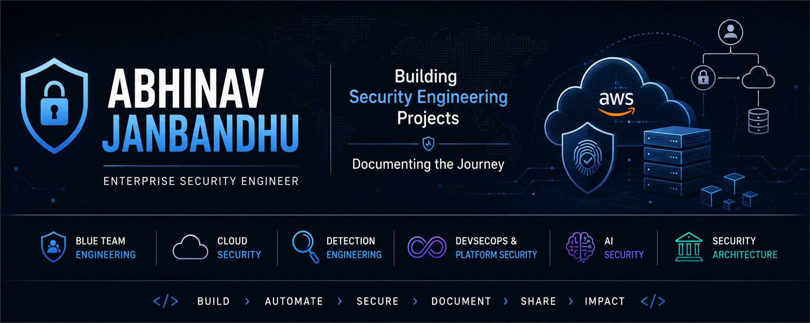

  

# Hi, I'm Abhinav Janbandhu 👋

### Enterprise Security Engineer | Building and documenting Security Engineering projects.

With 14+ years of experience securing enterprise environments, I'm building a public portfolio of hands-on Security Engineering projects that demonstrate practical skills across Blue Team Operations, Cloud Security, Detection Engineering, DevSecOps, AI Security, and Security Architecture.

Every repository is built from scratch, documented with lessons learned, and shared to help others learn through practical, real-world examples.

> **Build. Secure. Automate. Document. Share.**

---

## 👨‍💻 About Me

- 💼 14+ years securing enterprise environments
- ☁️ Currently focused on Cloud Security Engineering
- 🛡️ Building practical Security Engineering projects
- 🐍 Automating security workflows with Python
- 📖 Learning in public through GitHub, LinkedIn, and Medium

---

## 🚀 What I'm Building

- 🛡️ Blue Team Engineering
- ☁️ Cloud Security Engineering
- 🔍 Detection Engineering
- ⚙️ DevSecOps & Platform Security
- 🤖 AI Security
- 🏗️ Security Architecture

---

## 🗺️ Security Engineering Journey

| Phase | Status |
|--------|--------|
| 🛡️ Blue Team Engineering | ✅ Completed |
| ☁️ Cloud Security Engineering | 🔄 In Progress |
| 🔍 Detection Engineering | ⬜ Planned |
| ⚙️ DevSecOps & Platform Security | ⬜ Planned |
| 🤖 AI Security | ⬜ Planned |
| 🏗️ Security Architecture | ⬜ Planned |
| 👔 Executive Security Leadership | ⬜ Planned |

---

## ⭐ Featured Projects

| Project | Description |
|----------|-------------|
| 🛡️ Linux Security Monitoring Lab | Linux hardening, auditing, monitoring, and incident detection |
| 🔍 Linux Detection Engineering Lab | Threat hunting, detection engineering, and investigations |
| ☁️ AWS Cloud Security Labs | IAM, Networking, EC2 Security, Security Groups, and cloud security best practices |

> More projects will be added as I progress through my Security Engineering journey.

---

## ⚙️ Technologies

`AWS` • `Linux` • `Python` • `Bash` • `Git` • `GitHub` • `Docker` • `Splunk` • `IBM Guardium` • `SQL` • `Ansible`

---

## 📝 Writing

Every major project includes:

- 📂 GitHub Repository
- 📝 Technical Documentation
- 🏗️ Architecture Diagram
- 📸 Lab Walkthrough
- 💡 Key Lessons Learned

---

## 📫 Connect

- 💼 **LinkedIn:** https://linkedin.com/in/abhinavjanbandhu
- ✍️ **Medium:** https://medium.com/@janbandhuabhinav

---

> *Building one project today that makes me a better Security Engineer tomorrow.*
